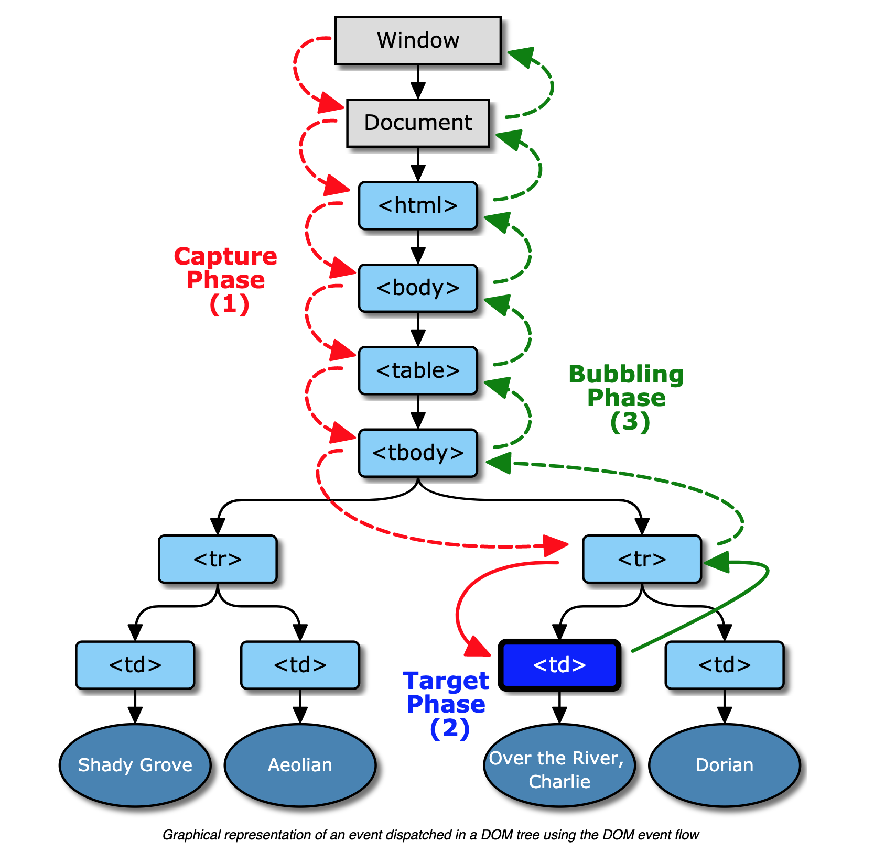

# Event dispatch and DOM event flow

Event objects are dispatched to an **event target**. But before dispatch can begin, the event object’s **propagation path** must first be determined.

### Propagation path

is an ordered list of current event targets through which the event passes. This propagation path reflects the hierarchical tree structure of the document. The last item in the list is the event target, and the preceding items in the list are referred to as the _target’s ancestors_, with the immediately preceding item as the _target’s parent_.

Once the propagation path has been determined, the event object passes through one or more event phases. There are three event phases: **capture phase**, **target phase** and **bubble phase**. Event objects complete these phases as described below. A phase will be skipped if it is not supported, or if the event object’s propagation has been stopped. For example, if the `bubbles` attribute is set to false, the bubble phase will be skipped, and if `stopPropagation()` has been called prior to the dispatch, all phases will be skipped.

* The **capture phase**: The event object propagates through the target’s ancestors from the Window to the target’s parent. This phase is also known as the _capturing phase_.
* The **target phase**: The event object arrives at the event object’s event target. This phase is also known as the _at-target phase_. If the event type indicates that the event doesn’t bubble, then the event object will halt after completion of this phase.
* The **bubble phase**: The event object propagates through the target’s ancestors in reverse order, starting with the target’s parent and ending with the Window. This phase is also known as the _bubbling phase_.

